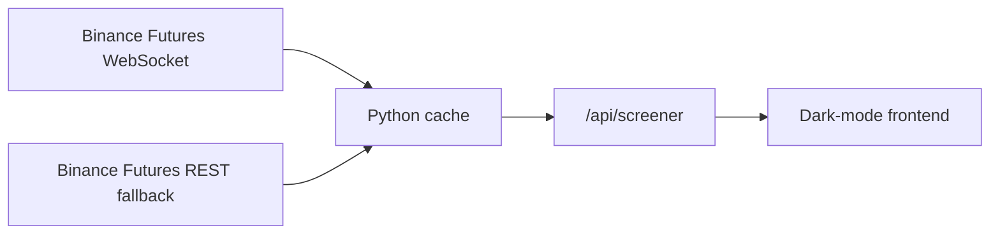

# Binance Futures Screener

Realtime Binance USD-M Futures screener with a lightweight Python backend cache and a dark-mode trading-terminal interface.

This is an independent portfolio project. It is not coupled to a larger dashboard repo, Dash, Plotly, Pandas, CCXT, PostgreSQL, or any private exchange credentials.

## What It Does

- Streams or fetches Binance Futures market data server-side.
- Serves a browser screener that refreshes every 1 second.
- Ranks symbols by price movement, volume, open interest, funding, volatility, and trade count.
- Uses a backend cache so visitors do not hit Binance directly from their own IP.
- Shows clear UTC timestamps and cache freshness.
- Runs on Render Free, Docker, or any small Python web host.

## Architecture



## Tech Stack

- Python
- Flask
- Requests
- websocket-client
- Vanilla HTML/CSS/JavaScript
- Gunicorn

## Local Run

```powershell
python -m venv .venv
.\.venv\Scripts\activate
pip install -r requirements.txt
python server.py
```

Open:

```text
http://127.0.0.1:8050/
```

Health check:

```text
http://127.0.0.1:8050/api/healthz
```

Screener API:

```text
http://127.0.0.1:8050/api/screener
```

## Signal Score

The `Sig` column is a 0-100 anomaly score. It is calculated by this app, not by Binance.

Inputs:

- absolute 5-minute return
- absolute 1-hour return
- absolute 1-day return
- 15-minute volatility
- absolute 1-hour open-interest change
- absolute funding rate
- 24-hour notional volume bonus

Score bands:

| Score | Meaning |
| --- | --- |
| 0-39 | Normal market noise |
| 40-69 | Worth monitoring |
| 70-84 | Strong anomaly |
| 85-100 | Priority review |

## API Contract

`GET /api/screener`

Returns:

```json
{
  "status": "live",
  "exchange": "binance",
  "venue": "Binance Futures",
  "source": "binance_ws",
  "generatedAt": "2026-06-26T13:30:00Z",
  "deepGeneratedAt": "2026-06-26T13:29:42Z",
  "cacheAgeMs": 180,
  "streamAgeMs": 420,
  "quoteRefreshMs": 1000,
  "deepRefreshMs": 60000,
  "baseRefreshing": false,
  "deepRefreshing": false,
  "lastError": null,
  "rows": []
}
```

## Deployment

### Render

Create a new Render Blueprint from this repository. `render.yaml` defines a free web service named:

```text
binance-futures-screener
```

The expected Render URL is:

```text
https://binance-futures-screener.onrender.com
```

### Docker

```bash
docker build -t binance-futures-screener .
docker run --rm -p 8050:7860 binance-futures-screener
```

## Environment Variables

| Variable | Default | Purpose |
| --- | --- | --- |
| `SCREENER_ENABLE_WS` | `1` | Enables Binance WebSocket streams |
| `SCREENER_REST_QUOTE_TTL_SECONDS` | `10` | REST fallback cooldown |
| `SCREENER_DEEP_TTL_SECONDS` | `60` | Deep metric cache lifetime |
| `SCREENER_HYDRATE_LIMIT` | `56` | Number of top symbols hydrated with deep metrics |
| `SCREENER_DEEP_WORKERS` | `5` | Concurrent deep metric workers |
| `SCREENER_ALLOWED_ORIGINS` | `*` | CORS origin allowlist |

## Security

This app uses public Binance market-data endpoints only.

It does not use:

- passwords
- private API keys
- exchange account credentials
- database credentials
- sessions

## Limitations

Public market data is useful for realtime triage, but it does not prove trader intent or account-level misconduct. Binance may rate-limit or block hosting-provider IPs. The backend cache centralizes that risk and makes it easier to manage than browser-direct exchange calls.
